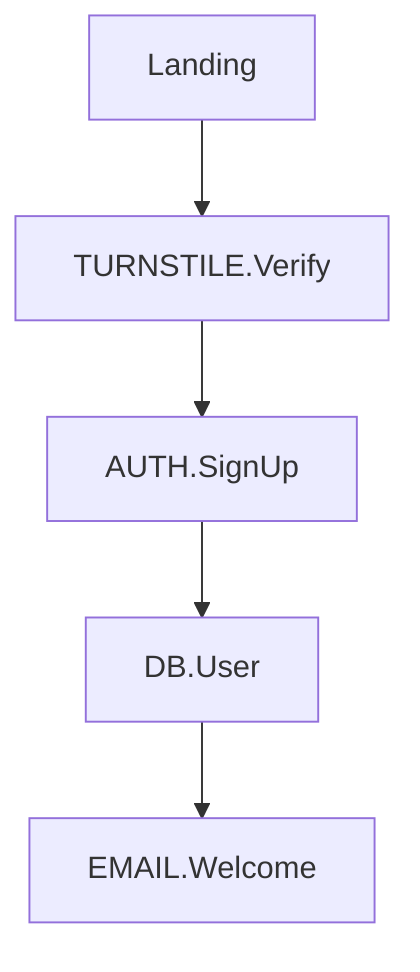

# Feature Tree v2 Improvements

## Gap Analysis: v1 → Vision

| V1 Has | Vision Requires |
|--------|-----------------|
| Feature CRUD | Context, Users, Journeys, Flows above features |
| Code symbols/files | Assumptions tracking |
| Commit integration | Priority markers (MVP/LATER/NEVER) |
| Status lifecycle | Learnings capture |
| Session continuity | Multiple operation modes |
| Flat/shallow hierarchy | Deep hierarchy with explicit types |

---

## IMPROVEMENTS

### 1. CONTEXT Layer

**Problem:** No persistent product context. Claude re-learns project purpose each session.

**Solution:** `.feat-tree/CONTEXT.md` — root document Claude reads on session start.

```markdown
# CONTEXT

## Problem
[What pain point does this solve?]

## Target Users
[Who is this for? Brief descriptions.]

## Success Criteria
[How do we know it's working?]

## Constraints
[Solo dev? Budget? Platform requirements?]

## Key Assumptions
- [untested] Users will self-onboard
- [validated] Mobile-first is correct (usage data confirms)
- [invalidated] Email verification is necessary (30% drop-off)
```

**Implementation:**
- Create template on `ft init`
- Claude reads this automatically via onboarding skill
- No MCP tool needed — it's just a file

**Effort:** Low (template + prompt update)

---

### 2. Two Parallel Trees: Features & Workflows

**Problem:** Features are flat. No way to express "Login Flow uses AUTH.SignUp + DB.User + TURNSTILE". No user journey context.

**Solution:** Two separate hierarchies. Flows reference features, but don't contain them.

```
FEATURES (what exists)          WORKFLOWS (how it's used)
─────────────────────           ────────────────────────
# Domain                        # Journey
## Feature                      ## Flow
### Subfeature                     └─ depends_on: [feature IDs]
                                   └─ mermaid diagram
```

**Why parallel, not nested:**
- A feature can be used by multiple flows
- Features exist independently (you might build before knowing which flow needs it)
- Deleting a flow doesn't delete features
- The relationship is **reference**, not **containment**

**Data model:**

```python
# Features (existing, add hierarchy)
type: "domain" | "feature" | "subfeature"
parent_id: str

# Workflows (new table/structure)
type: "journey" | "flow"
parent_id: str  # flow's parent is journey
depends_on: list[str]  # feature IDs this flow uses
mermaid: str | None  # optional diagram
purpose: str  # for journeys: "Stranger → active user"
```

**New MCP tools:**

| Tool | Description |
|------|-------------|
| `add_journey(id, name, purpose)` | Create journey |
| `add_flow(id, name, journey_id, depends_on, mermaid?)` | Create flow under journey |
| `list_workflows(journey_id?)` | List journeys/flows |
| `get_flow_features(flow_id)` | Return features this flow depends on |
| `get_feature_flows(feature_id)` | Return flows that use this feature |

**The bidirectional query is key:**
- Editing a feature? → `get_feature_flows` shows what breaks
- Designing a flow? → See which features exist vs. need building

**Effort:** Medium (new table + tools, but features table mostly unchanged)

---

### 3. Flows with Mermaid Diagrams

**Problem:** No visual composition. Can't see how features work together.

**Solution:** Flows store optional mermaid diagram.

```markdown
### Sign Up Flow

Features: TURNSTILE.Verify, AUTH.SignUp, DB.User, EMAIL.Welcome
```

**Implementation:**
- Add `mermaid` field to flows
- Auto-extract feature references from diagram (regex `[A-Z]+\.[A-Za-z]+`)
- Or: explicit `depends_on` field, mermaid is just documentation

**Effort:** Low (just a text field + FEATURES.md rendering)

---

### 4. Priority Markers

**Problem:** No way to distinguish MVP from LATER from NEVER. Claude might build non-essential features.

**Solution:** Priority field on features and flows.

```python
priority: "mvp" | "later" | "never" | None
```

**Display in FEATURES.md:**

```markdown
### AUTH.SignUp [MVP]
### AUTH.SocialLogin [LATER]
### AUTH.EnterpriseSSO [NEVER - not our market]
```

**Claude behavior:**
- When implementing, check priority
- Warn if user asks to build [LATER] item
- Refuse [NEVER] items with explanation

**Effort:** Low (one field + prompt update)

---

### 5. Assumptions Tracking

**Problem:** Decisions are made on assumptions. When assumptions prove wrong, no way to trace back to what needs changing.

**Solution:** Assumptions field with validation status.

```python
assumptions: list[{
    text: str,
    status: "untested" | "validated" | "invalidated"
}]
```

**On features/flows:**

```markdown
### Email Verification Flow
Assumptions:
- [untested] Users have reliable email access
- [invalidated] Email verification reduces spam signups
```

**Claude behavior:**
- When assumption invalidated, flag affected features/flows
- Prompt: "This assumption was invalidated. Consider redesigning."

**Effort:** Low-Medium (schema + display + prompt logic)

---

### 6. Learnings Capture

**Problem:** No feedback loop. Insights from reality don't connect back to design.

**Solution:** Learnings field on flows, captured post-launch.

```markdown
### Sign Up Flow [LAUNCHED: 2025-01-15]

Learnings:
- 30% drop-off at email verification
- 5 support tickets asking for Google login
- Mobile completion 20% lower than desktop

Implications:
- Consider OAuth for v2
- Investigate mobile UX
```

**Implementation:**
- Add `learnings` field (text/structured)
- Add `launched_at` timestamp
- Prompt Claude to ask for learnings after launch

**Effort:** Low (fields + prompt)

---

### 7. Hard Delete for Planned Features

**Problem:** Currently soft-delete only. Planned features that never get built create ghost entries.

**Solution:** Delete behavior based on status.

| Status | Delete Behavior |
|--------|-----------------|
| `planned` | Hard delete (no trace) |
| `in-progress` | Soft delete (recoverable) |
| `done` | Soft delete (history matters) |

**Implementation:**
- Check status before delete
- Hard delete = actually remove from DB
- Or: Add `delete_mode` parameter to `delete_feature`

**Effort:** Low (logic change)

---

### 8. Minimal MCP Output

**Problem:** Verbose MCP responses waste context window.

**Current:**
```json
{
  "success": true,
  "message": "Feature 'AUTH.SignUp' has been successfully added to the tree under AUTH domain with ID auth-signup at timestamp 2025-01-15T10:30:00Z",
  "feature": { ... full feature object ... }
}
```

**Should be:**
```json
{"ok": true}
```

Or on error:
```json
{"ok": false, "error": "Feature not found"}
```

**Implementation:**
- Audit all MCP tool responses
- Strip to essential info only
- Full data available via `get_feature` if needed

**Effort:** Low (response cleanup)

---

### 9. Operation Modes (Prompt-based)

**Problem:** Claude doesn't know whether user wants to discover, design, build, or learn.

**Solution:** Mode-specific prompts/skills. Not code — just different Claude behaviors.

| Mode | Trigger | Claude Behavior |
|------|---------|-----------------|
| DISCOVER | `/discover` or new project | Ask questions, don't build. Surface assumptions. |
| DESIGN | `/design` | Propose structure, ask for priorities, record decisions. |
| BUILD | Default | Implement features with full context. |
| LEARN | `/learn` or post-launch | Capture feedback, connect to design implications. |

**Implementation options:**

A) **Skills** (`.feat-tree/skills/discover.md`, etc.)
   - Claude reads appropriate skill based on command
   - Low effort, flexible

B) **System prompt injection**
   - Mode stored in state
   - Prompt varies by mode
   - More seamless but more complex

C) **Just documentation**
   - User knows to say "let's discover" vs "let's build"
   - Claude trained via README/onboarding
   - Lowest effort

**Recommendation:** Start with (C), evolve to (A) if needed.

**Effort:** Low (documentation) to Medium (skills)

---

### 10. USER MODELS

**Problem:** Building for abstract "users" leads to vague features.

**Solution:** `.feat-tree/USERS.md` with persona templates.

```markdown
# USERS

## Producer: Maria
- Small organic farmer, 50s
- Tech-uncomfortable, phone only
- Needs: Simple listing, reliable payments
- Pain: Wholesale takes 40% margin

## Consumer: James
- Urban professional, 30s
- Time-poor, health-conscious
- Needs: Convenient ordering, trust in source
- Pain: "Local" labels feel fake
```

**Claude behavior:**
- Reference personas when designing flows
- "Would Maria understand this?"
- "Does this solve James's pain?"

**Implementation:**
- Template on `ft init`
- Claude reads automatically
- No MCP tool needed

**Effort:** Low (template + prompt)

---

### 11. Bootstrap from Existing Codebase

**Problem:** Building tree for existing project is tedious. Nobody will do it manually.

**Solution:** Semi-automated analysis.

**Workflow:**
1. User runs `/bootstrap` or `ft analyze`
2. Claude reads file structure, exports, symbols
3. Claude proposes initial tree
4. User corrects, validates
5. Tree populated with inferred Symbols/Files

**Implementation:**
- Hook or command that triggers analysis
- Claude uses LSP/file reading
- Proposes tree in markdown, user approves
- Batch `add_feature` calls

**Effort:** Medium (analysis logic + approval flow)

---

### 12. Impact Analysis

**Problem:** Changing a feature — what breaks? Currently requires mental tracking.

**Solution:** Bidirectional queries between the two trees (see #2).

**Tools (included in #2):**

| Tool | Description |
|------|-------------|
| `get_feature_flows(feature_id)` | What flows depend on this feature? |
| `get_flow_features(flow_id)` | What features does this flow need? |

**Display:**
```
> Changing AUTH.SignUp. What's affected?

Flows using AUTH.SignUp:
- Sign Up Flow [MVP]
- Social Login Flow [LATER]
```

**Implementation:**
- Query `depends_on` relationships in workflows table
- This is part of the parallel trees structure, not a separate feature

**Effort:** Included in #2

---

## PRIORITY RANKING

| Priority | Improvement | Effort | Impact |
|----------|-------------|--------|--------|
| 1 | Minimal MCP output | Low | High (every interaction) |
| 2 | Hard delete for planned | Low | Medium (cleaner state) |
| 3 | Priority markers | Low | High (MVP clarity) |
| 4 | CONTEXT.md template | Low | High (persistent product context) |
| 5 | USERS.md template | Low | Medium (persona grounding) |
| 6 | Two Parallel Trees (Features & Workflows) | Medium | High (core model upgrade) |
| 7 | Assumptions tracking | Low-Medium | Medium (decision traceability) |
| 8 | Learnings capture | Low | Medium (feedback loop) |
| 9 | Mermaid in flows | Low | Medium (visual composition) |
| 10 | Operation modes | Low-Medium | Medium (UX clarity) |
| 11 | Bootstrap existing | Medium | Medium (adoption friction) |

---

## RECOMMENDED SEQUENCE

### Phase 1: Quick Wins (1-2 days)
- [ ] Minimal MCP output
- [ ] Hard delete for planned features
- [ ] Priority markers (mvp/later/never)
- [ ] CONTEXT.md template
- [ ] USERS.md template

### Phase 2: Core Model (3-5 days)
- [ ] Two Parallel Trees (Features & Workflows tables)
- [ ] Flows with Mermaid diagrams
- [ ] depends_on field linking flows → features
- [ ] Bidirectional queries (feature → flows, flow → features)

### Phase 3: Feedback Loop (2-3 days)
- [ ] Assumptions tracking
- [ ] Learnings capture
- [ ] Operation modes (prompt-based)

### Phase 4: Adoption (ongoing)
- [ ] Bootstrap from existing codebase
- [ ] Better onboarding skill
- [ ] Documentation/examples

---

## PHILOSOPHY REMINDER

Feature Tree is a **product operation terminal**, not a coding tool.

Every improvement should serve this:
1. Human operates at abstraction layer AI can't replace
2. AI has full context, never re-explained
3. Development stays coherent across time
4. Learning from reality feeds back into design

If an improvement doesn't serve these, cut it.
