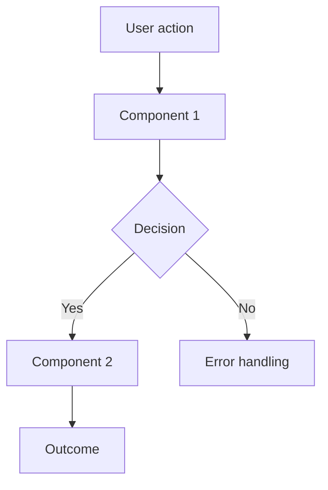

# Feature Tree Brainstorming

Turn ideas into fully formed designs through collaborative dialogue. This skill has THREE PHASES that must be completed in order:

1. **Discovery** — Understand the problem, find actual intention
2. **Design** — Architecture, tech stack, components
3. **Specification** — Features, workflows, implementation plan

**Announce at start:** "I'm using the feature-tree:brainstorm skill to design this properly."

---

## Phase 1: Discovery

### The Mentality

**Don't execute literally. Find the actual intention.**

User requests often contain surface symptoms, not root causes. Solutions they think they want, not what they need.

```
USER REQUEST
    ↓
SURFACE INTERPRETATION (what they said)
    ↓
ACTUAL INTENTION (why they said it)
    ↓
SMART SOLUTION (address the real need)
```

**Example:**

User: "Don't use emojis and gradient colors in the dashboard"

| Level | Content |
|-------|---------|
| Surface | Remove emojis, remove gradients |
| Intention | "The UI looks AI-designed and it's embarrassing" |
| Smart solution | Research good design principles → understand the project's vibe → propose a design language based on wisdom, not default AI aesthetics |

### Before Anything Else

1. **Check Feature Tree context:**
   ```
   search_features("relevant keywords")
   search_workflows("relevant keywords")
   ```
2. **Present relevant context:** "I found these existing features/workflows that might relate..."

### Two Planning Modes

Detect which mode from the user's request:

**Forward Planning** (Journey → Flow → Feature)
- "Users should be able to..."
- "I want to add..."
- "We need a way to..."

**Reverse Planning** (Problem → Solution → Feature)
- "Users are struggling with..."
- "We need to fix..."
- "This is broken..."

If ambiguous, ask: "Are you designing a new experience (Forward) or solving a problem (Reverse)?"

### Mind Tool Checkpoints

**These are NOT optional.** For each mind tool, you MUST either:
- Apply it and document the finding, OR
- Explicitly state why it doesn't apply to this situation

Work through them conversationally with the user. Don't rush. These checkpoints often reveal the most important insights.

---

#### Checkpoint 1: First Principle Reasoning

**WHY IT EXISTS:** People communicate in solutions, not problems. "Add a spinner" is a solution. The problem might be "page feels slow" — which has ten better solutions than a spinner. If you execute the solution without understanding the problem, you might build the wrong thing perfectly.

**THE INSIGHT:** There's always a gap between what someone says and what they mean. The gap isn't deception — it's just how humans communicate. They've already done the (often flawed) reasoning from problem to solution in their head, then handed you the conclusion.

**WHEN IT MATTERS:** User gives a specific request without explaining why. The request is a solution to an unstated problem.

**WHAT YOU'RE LOOKING FOR:** The actual intention. The frustration or desire that spawned the request. Once you find it, you can often propose something better than what they asked for.

**CHECKPOINT OUTPUT:**
```
First Principle Reasoning:
- Surface request: [what they said]
- Actual intention: [why they said it]
- Better approach: [if any] OR [surface request IS the right approach because...]
```

---

#### Checkpoint 2: The Crux Finder

**WHY IT EXISTS:** Every project has a core bet — an assumption that if true means this works, if false means it doesn't. People bury this under months of building before testing it. They build auth systems and polish UIs before checking if anyone wants the core thing.

**THE INSIGHT:** Building feels productive. "Finding the crux" feels like stalling. But testing the wrong assumption efficiently is still waste. If the core bet is wrong, everything built on top of it is worthless.

**WHEN IT MATTERS:** Starting something new. Before significant investment. When there's implicit optimism that hasn't been examined.

**WHAT YOU'RE LOOKING FOR:** The ONE belief that everything else depends on. Then: how to test it with minimum investment before building.

**CHECKPOINT OUTPUT:**
```
Crux Finder:
- Core assumption: [the ONE thing that must be true]
- If wrong: [what happens to the project]
- Test approach: [how to validate with minimal investment]
- Status: [untested / validated / skip - already validated because...]
```

---

#### Checkpoint 3: Pre-Mortem

**WHY IT EXISTS:** "What could go wrong?" triggers self-censorship. It feels pessimistic, disloyal, like you're not a team player. But "why did it fail?" is just forensics — analyzing something that already happened. The hypothetical framing gives social cover to say the uncomfortable things everyone suspects but nobody's saying.

**THE INSIGHT:** The psychological trick of past-tense framing unlocks honesty. People will say things in a pre-mortem they'd never say in a risk assessment.

**WHEN IT MATTERS:** After initial enthusiasm, before building. Before major commitments. When optimism is high and no one's playing devil's advocate.

**WHAT YOU'RE LOOKING FOR:** The failure modes people are secretly worried about. Early warning signs. Preventive measures that seem obvious once spoken but nobody was going to say.

**CHECKPOINT OUTPUT:**
```
Pre-Mortem:
- "It failed because...": [top 3 failure modes]
- Early warning signs: [what to watch for]
- Mitigations: [preventive measures]
- OR: Skip - [reason this doesn't apply, e.g., "trivial change with no failure modes"]
```

---

#### Checkpoint 4: Scope Fence

**WHY IT EXISTS:** Most projects die of scope creep, not bad core ideas. Features accrete. "What if we also..." multiplies. Each addition seems small but they compound into a monster that never ships.

**THE INSIGHT:** Saying "we are NOT doing X" out loud creates permission to focus. It's almost physically relieving. The negative space defines the positive space. Explicit boundaries prevent implicit expansion.

**WHEN IT MATTERS:** When the feature list is growing. When "nice to have" is indistinguishable from "essential." When scope has never been explicitly discussed.

**WHAT YOU'RE LOOKING FOR:** The NOTs. What this explicitly isn't. What users you're okay losing. What features you're saying no to. The one-sentence answer to "what is this?"

**CHECKPOINT OUTPUT:**
```
Scope Fence:
- This IS: [one sentence]
- This is NOT: [explicit exclusions]
- Users we're okay losing: [who this isn't for]
- Features we're saying no to: [cut list]
```

---

#### Checkpoint 5: User Day-In-Life

**WHY IT EXISTS:** "Users" as an abstraction lets you build for imaginary people. You can convince yourself anyone would want anything if you never get specific. But when you pick a real person with a real name and walk through their real Tuesday, the bullshit evaporates. Either you can describe their day concretely or you can't — and if you can't, you don't understand your user yet.

**THE INSIGHT:** Specificity is a bullshit detector. If the exercise feels hard, that's information — you need to go learn about your users before designing for them.

**WHEN IT MATTERS:** When "users" is plural and vague. When the problem statement is abstract. When no one can describe WHO specifically has this problem and WHEN in their day it appears.

**WHAT YOU'RE LOOKING FOR:** A specific person (named), their context, WHEN the problem appears in their day, what they currently do about it, what's annoying about that. This person becomes the reference point for all design decisions.

**CHECKPOINT OUTPUT:**
```
User Day-In-Life:
- Name: [specific person, real or composite]
- Context: [job, situation]
- When problem appears: [specific moment in their day]
- Current workaround: [what they do now]
- Pain point: [what's annoying about it]
- OR: Skip - [reason, e.g., "internal tool, user is us"]
```

---

## Phase 2: Design

After completing Discovery checkpoints, move to Design. This phase covers the technical foundation.

### Conversation Style

- Ask questions one at a time — don't overwhelm
- Prefer multiple choice when possible, open-ended when exploring
- Propose 2-3 different approaches with trade-offs
- Lead with your recommended option and explain why
- Present in sections of 200-300 words, check after each

### Architecture Discussion

Explore and document:

1. **System Overview** — What are the major components? How do they interact?
2. **Data Model** — What data exists? How is it structured? What are the relationships?
3. **Integration Points** — What external systems/APIs? How does auth work?
4. **State Management** — Where does state live? How does it flow?

### Tech Stack Discussion

For each technology choice, discuss:
- What are the options?
- Why this choice over alternatives?
- What are the trade-offs?
- Does the team have experience with it?

**Example format:**
```
Tech Stack Discussion:

Database:
- Options: PostgreSQL, SQLite, MongoDB
- Choice: SQLite
- Rationale: Portable, no server needed, sufficient for single-user
- Trade-off: No concurrent writes, but acceptable for this use case

API Style:
- Options: REST, GraphQL, tRPC
- Choice: REST
- Rationale: Simpler, team knows it, fits the CRUD nature of this app
- Trade-off: Multiple requests for complex data, acceptable
```

### Component Design

For each major component:
- What does it do?
- What are its inputs/outputs?
- What are the edge cases?
- How does it handle errors?

### Flow Diagrams

Use mermaid for clarity:



---

## Phase 3: Specification

After Design is validated, create the specification for implementation.

### Features Identified

Map the design to Feature Tree entries:

| ID | Name | Type | Dependencies | Notes |
|----|------|------|--------------|-------|
| AUTH.login | User Login | feature | INFRA.session | Entry point |
| INFRA.session | Session Management | infra | - | Shared utility |
| NEW.feature | New Capability | new | AUTH.login | Needs implementation |

### Workflows Identified

Map user journeys to workflows:

| ID | Name | Depends On | Notes |
|----|------|------------|-------|
| USER.login_flow | Login Flow | AUTH.login, AUTH.session | Happy path |
| USER.login_error | Login Error | AUTH.login | Error handling |

### Implementation Tasks

Break down into implementable chunks:

```markdown
### Task 1: [Component/Feature Name]
**Goal:** [What this task accomplishes]
**Features:** [Which FT features this implements]
**Depends on:** [What must be done first]

### Task 2: [Component/Feature Name]
...
```

---

## Design Doc Output

### Structure

```markdown
# [Topic] Design

> **For Claude:** REQUIRED SUB-SKILL: Use feature-tree:executing-plans to implement this design.

## Context
- What exists (from FT search)
- Why we're designing this

## Discovery

### First Principle Reasoning
[checkpoint output]

### Crux
[checkpoint output]

### Pre-Mortem
[checkpoint output]

### Scope Fence
[checkpoint output]

### User Day-In-Life
[checkpoint output]

## Design

### Architecture
[system overview, major components, interactions]

### Tech Stack
| Technology | Choice | Rationale |
|------------|--------|-----------|
| Database | SQLite | Portable, no server |
| API | REST | Simple, team knows it |
| Frontend | React | Component model fits |

### Data Model
[entities, relationships, schema notes]

### Component Design
[for each major component]

### Flow Diagrams
[mermaid diagrams]

## Specification

### Features
| ID | Name | Type | Dependencies |
|----|------|------|--------------|
| ... | ... | ... | ... |

### Workflows
| ID | Name | Depends On |
|----|------|------------|
| ... | ... | ... |

### Implementation Tasks
1. [Task 1]
2. [Task 2]
...

## Open Questions
- [Unresolved items]
```

---

## After Design Approval

### 1. Save Design Doc

Write to `docs/plans/YYYY-MM-DD-<topic>-design.md`

(Plans are gitignored — don't commit)

### 2. Populate Feature Tree

**REQUIRED:** Create the features and workflows in Feature Tree.

```
Creating in Feature Tree:

Workflows:
- USER_ONBOARDING.signup_flow
- USER_ONBOARDING.verify_flow

Features (new):
- AUTH.register
- AUTH.email_verify

Features (reuse):
- DB.user (exists)
```

Create with proper `depends_on` relationships and mermaid diagrams.

### 3. Sync Project Memory

**REQUIRED SUB-SKILL:** Use `ft-mem:brainstorm-sync` to sync discoveries to project memory.

This updates:
- CONTEXT.md with new insights
- Memories with technical decisions, scope fences, user insights

If ft-mem is not installed, inform the user: "ft-mem plugin not found — skipping memory sync. Consider installing for session continuity."

### 4. Implementation Handoff

```
Design complete and saved. Ready to implement?

1. Start implementation (uses feature-tree:executing-plans)
2. Done for now (I'll implement later)
```

If starting implementation:
- **REQUIRED SUB-SKILL:** Use `feature-tree:executing-plans` to implement the design task-by-task

---

## Key Principles

1. **Three phases in order** — Discovery → Design → Specification. Don't skip.

2. **Mind tools are checkpoints** — Must consider each one. Can skip with documented reason, but must explicitly address.

3. **Tech stack requires rationale** — Every choice needs "why this over alternatives"

4. **Workflow-first** — Human creativity at the abstract level, descend to features later

5. **Find actual intention** — Surface requests hide real needs; ask "why" gently

6. **One question at a time** — Don't overwhelm; prefer choices when possible

7. **Explore alternatives** — Always propose 2-3 approaches before settling

8. **Mermaid for clarity** — Visual diagrams help humans validate

9. **YAGNI ruthlessly** — Remove unnecessary features from all designs

10. **Incremental validation** — Present in sections, check each one

---

## Red Flags

**Never:**
- Skip mind tool checkpoints without explicit reason
- Make tech stack choices without discussing alternatives
- Write design doc before completing all three phases
- Skip ft-mem:brainstorm-sync (unless plugin not installed)
- Start implementation without offering executing-plans skill
- Rush through Discovery to get to "the real work"

**The Discovery phase IS the real work.** Bad Discovery = building the wrong thing efficiently.
